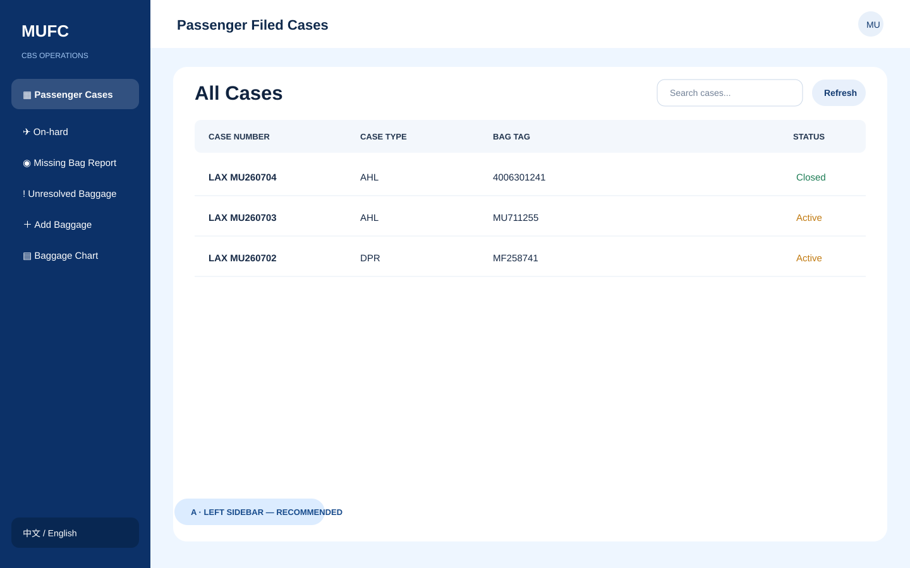
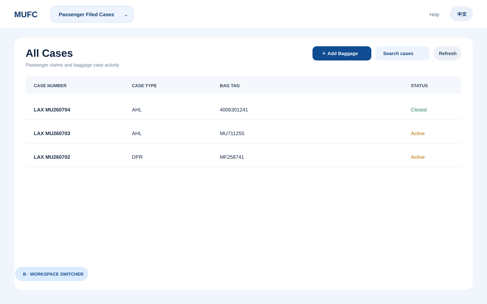
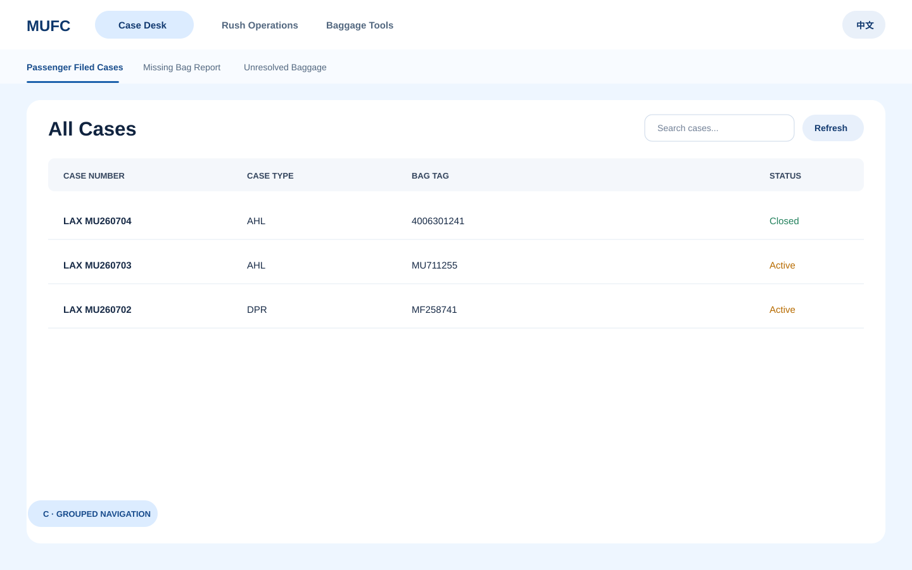

# CBS navigation concepts

These concepts reduce the six-item horizontal navigation without changing the
existing case table or workflows.

## A. Left sidebar (recommended)

Persistent navigation works best on desktop and leaves room for future tools.
The sidebar can collapse to icons on smaller screens.

## B. Workspace switcher

The header contains one compact workspace dropdown. Frequently used actions
remain visible as buttons beside the page title.

## C. Grouped navigation

The header exposes three business groups. Selecting a group reveals a short
second row of related destinations.
